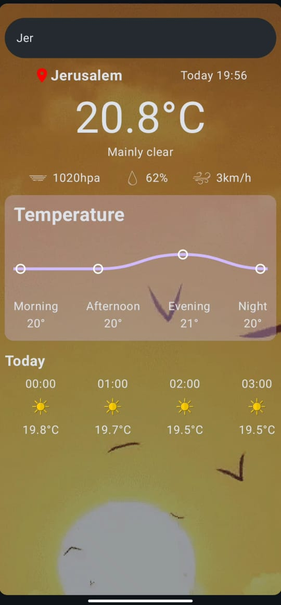
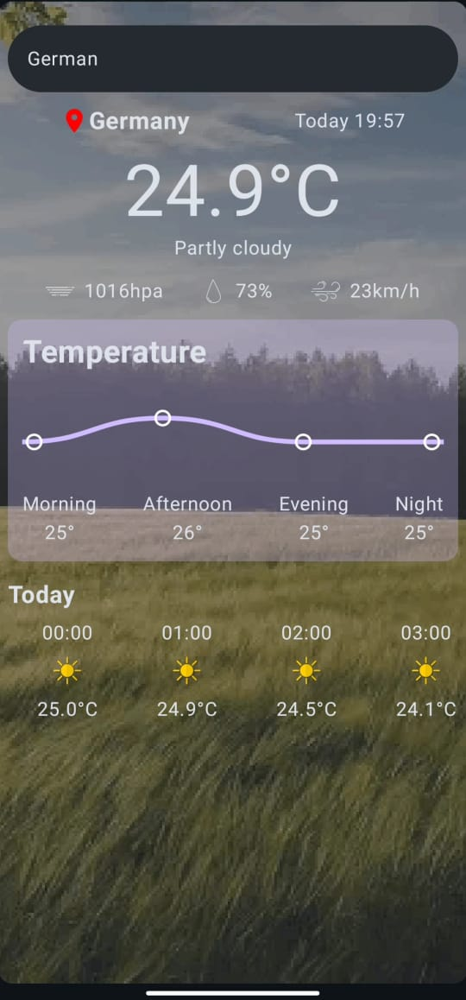
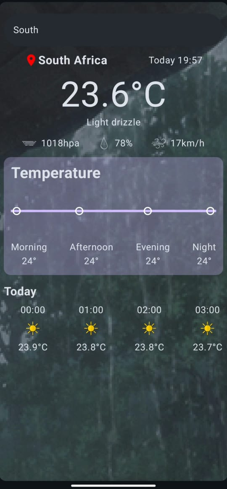
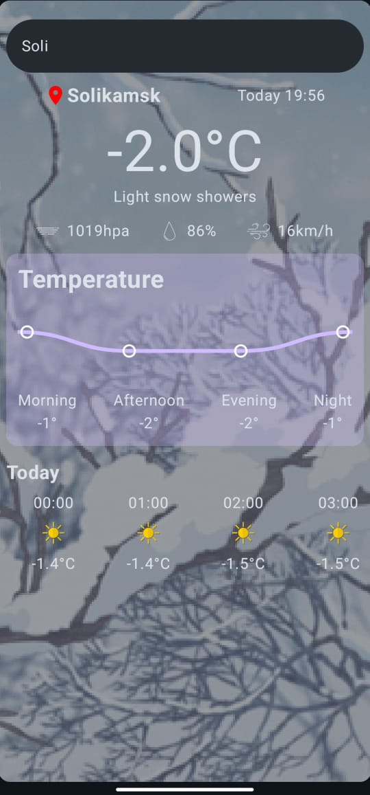

WeatherApp that trigger weather inforamtion per day

I used the latest Android technologies :
* Jetpack Compose  and Material 3 for Ui
* Kotlin Coroutines & Flows
* Canvas for custom drawing like chart
* koin💉
* MVI approach for clean architecture
* Ktor for client side
* Stadia SDK for autoComplete search about places

## 📷 Screenshots

<table style="width:100%">
<tr>
    <th>Sunny</th>
    <th>Cloudy</th> 
    <th>Rainy</th>
  </tr>
  <tr>
    <td></td> 
    <td></td>
    <td></td> 
  </tr>
  <tr>
    <th>Snowy</th>
    <th>video</th>
  </tr>
  <tr>
    <td></td>
    <td><video src="screenshots/sample.mp4" controls width="50%"></video></td>

  </tr>

</table>

